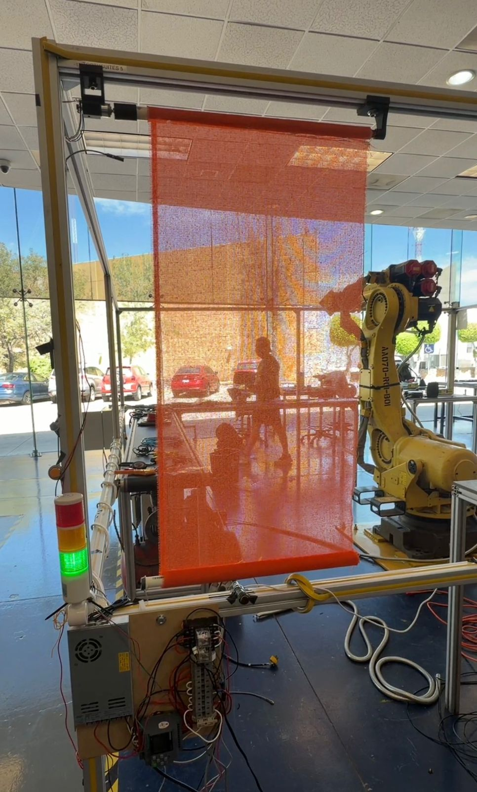
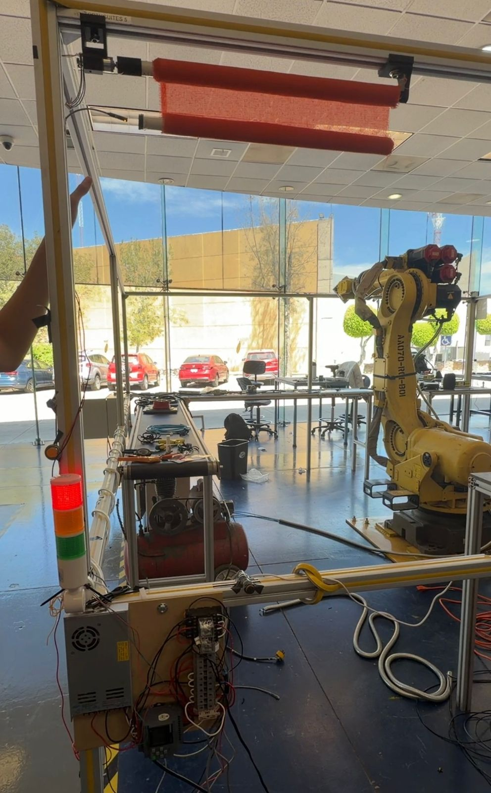
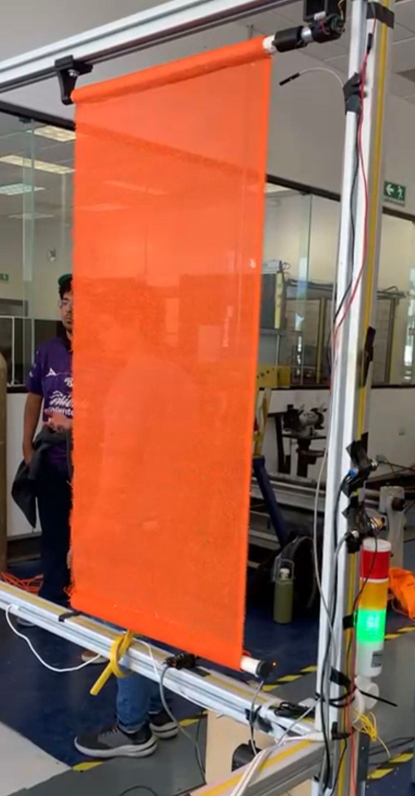
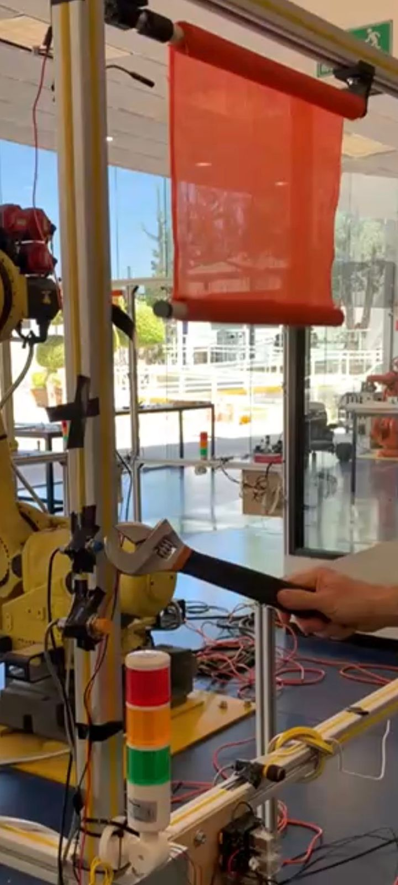

# Hito Final – Prototipo Funcional

## Descripción del prototipo

### Funcionamiento completo del sistema

El sistema de automatización de cortina industrial consta de los siguientes componentes y funcionamiento:

#### Componentes principales:

**Controlador:**
- Siemens LOGO! 12/24 RCE V8 programado con LOGO!Soft Comfort V8.0

**Sensores de entrada (I1-I6):**
- **I1 - Sensor capacitivo:** Detecta presencia de material no metálico (hule)
- **I2 - Sensor inductivo:** Detecta barras metálicas de tensión → Activa el sistema
- **I3 - Sensor óptico/infrarrojo:** Seguridad - detecta obstáculos/personas
- **I4 - Sensor magnético:** Detecta posición ARRIBA de la cortina
- **I5 - Sensor magnético:** Detecta posición MEDIA de la cortina
- **I6 - Sensor magnético:** Detecta posición ABAJO de la cortina

**Actuadores de salida (Q1-Q4):**
- **Q1 - Motor DC 24V (giro horario):** Enrolla/baja la cortina
- **Q2 - Motor DC 24V (giro anti-horario):** Desenrolla/sube la cortina
- **Q3 - Lámpara roja:** Indica alarma/paro de emergencia
- **Q4 - Lámpara verde:** Indica sistema OK/ciclo completado

#### Secuencia de operación:

1. **Activación:** El sensor inductivo (I2) detecta la barra metálica → El sistema se activa
2. **Descenso:** El motor (Q1) enrolla la cortina hacia ABAJO en sentido horario
3. **Seguridad activa:** Los sensores I1 (capacitivo) e I3 (óptico) monitorean obstáculos. Si detectan obstrucción → Motor se DETIENE y Luz ROJA (Q3) se activa
4. **Límite inferior:** Al llegar a la posición I6 (ABAJO) → Motor se apaga, Luz VERDE (Q4) se enciende
5. **Temporización:** El temporizador B006 cuenta 10 segundos de espera
6. **Ascenso:** El motor (Q2) invierte el giro y sube la cortina hasta I4 (ARRIBA)
7. **Reinicio:** El sistema retorna al estado inicial esperando nueva activación

#### Lógica de control implementada:

- **Compuertas AND/OR:** Para condiciones de operación
- **RS Flip-Flop (B009):** Memoria de estado del sistema
- **Timer (B006):** Retardo de 10 segundos
- **Interlocks:** Previenen que Q1 y Q2 se activen simultáneamente
- **Paros de emergencia:** Activación por detección de obstáculos (I1 o I3)

---

## Evidencias

### Fotos:

*Figura 1: Vista completa del sistema de cortina automatizada*

 

*Figura 2: Conexión del Siemens LOGO! y distribución de cableado*

 

*Figura 3: Sensores capacitivo, inductivo, óptico y magnéticos*

 

*Figura 4: Prototipo en operación con indicadores luminosos*

### Video:

[▶️ **Ver video de demostración del sistema completo**](https://youtu.be/jsxeerO_dHk?si=4y5mCOTqE1LufV9U)

---

## Validación del sistema

### ¿Cumple los requerimientos iniciales? Justifica:

✅ **SÍ CUMPLE** - El prototipo funcional cumple con todos los requerimientos iniciales planteados:

| Requerimiento | Cumplimiento | Justificación |
|---------------|--------------|---------------|
| **Automatización de ascenso/descenso** | ✅ Cumplido | El motor DC 24V opera en ambos sentidos (Q1 bajar, Q2 subir) controlado automáticamente por el PLC Siemens LOGO! |
| **Detección de obstáculos** | ✅ Cumplido | Sensores capacitivo (I1) y óptico (I3) detectan obstrucciones y activan inmediatamente paro de emergencia con luz roja (Q3) |
| **Control de límites de posición** | ✅ Cumplido | Sensores magnéticos en posiciones ARRIBA (I4), MEDIO (I5) y ABAJO (I6) detienen el motor en los límites exactos |
| **Seguridad para personas y vehículos** | ✅ Cumplido | Sistema de interlocks previene movimientos simultáneos; sensores de seguridad detienen operación ante cualquier obstáculo detectado |
| **Indicadores visuales de estado** | ✅ Cumplido | Luz ROJA (Q3) indica alarma/paro de emergencia; Luz VERDE (Q4) indica ciclo completado/sistema OK |
| **Temporización automática** | ✅ Cumplido | Timer B006 programa automáticamente 10 segundos de espera antes del ascenso, sin intervención manual |
| **Prototipo a escala funcional** | ✅ Cumplido | Prototipo de 1m x 2m con barra de 1-2kg demuestra la viabilidad del sistema a escala real (3-7m con 35kg) |

### Evidencias de validación:

- ✅ Todos los sensores fueron probados y calibrados individualmente (ver matriz de sensores en H2)
- ✅ La lógica de control fue programada y depurada en Siemens LOGO!Soft Comfort V8.0
- ✅ Los actuadores responden correctamente a las señales del controlador
- ✅ El sistema opera de forma 100% autónoma sin intervención manual
- ✅ Las pruebas de seguridad funcionan correctamente (paro inmediato ante obstrucción)
- ✅ Los interlocks previenen eficazmente activaciones simultáneas de Q1 y Q2

---

## Reflexión final

### Aprendizajes clave del proyecto:

#### 1. **Integración de sistemas mecatrónicos**
Aprendimos que un sistema mecatrónico funcional requiere la perfecta integración de **sensores, actuadores y control**. No basta con tener buenos componentes individuales; la clave está en su interconexión y programación adecuada.

#### 2. **Importancia de la calibración**
Uno de los mayores desafíos fue calibrar correctamente los sensores magnéticos. Inicialmente los teníamos a más de 1.5cm de distancia y no detectaban consistentemente. Al reducir la distancia a **5mm**, el funcionamiento fue óptimo. Esto nos enseñó que los detalles prácticos son tan importantes como el diseño teórico.

#### 3. **Trabajo en equipo y resolución de problemas**
Cada miembro del equipo aportó en diferentes áreas (sensores, actuadores, programación, pruebas). La **comunicación efectiva** y la **división de responsabilidades** fueron clave para el éxito.

